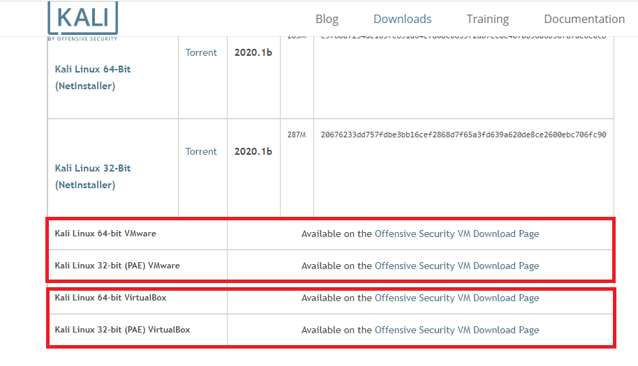
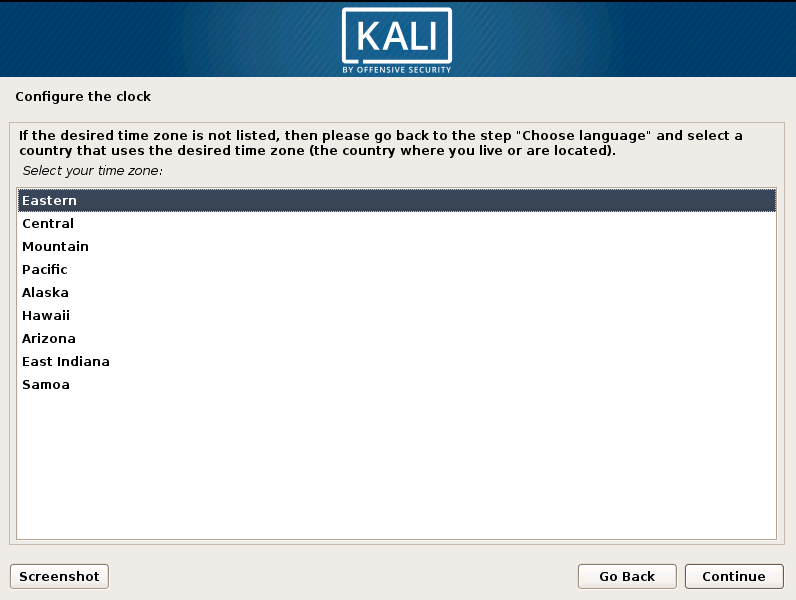
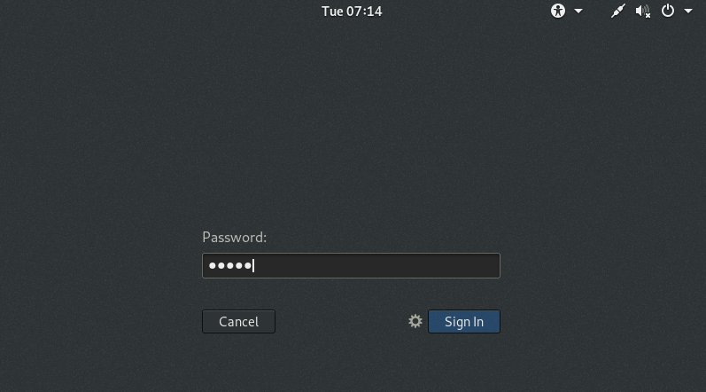

# হ্যাকিং ল্যাব সেটআপ

**ইথিক্যাল হ্যাকিং** এর জন্য আমরা কালি লিনাক্স অপারেটিং সিস্টেম ব্যবহার করবো কারন কালি লিনাক্সে অনেক প্রি-ডিফাইন্ড টুলস রয়েছে হ্যাকিং এর সুবিধার্থে। এই জন্য প্রথমেই আমাদের একটি ভার্চুয়াল মেশিন ও কিছু টুলস ইন্সটল দিতে হবে। হ্যাকিং এর জন্য আমাদের যা যা ইন্সটল দিতে হবে-

## ভার্চুয়াল মেশিন 

ভার্চুয়াল মেশিন \(Virtual machine\) হচ্ছে এমন এক ধরণের বিশেষ মেশিন যার কোনো পিজিক্যাল এক্সেস নাই, এটি শুধু কল্পনা করা যায়। এটি একটি কম্পিউটার সিস্টেমের অনুকরণ হয়ে থাকে। একটি কম্পিউটারের প্রধান অংশ গুলো হচ্ছে র‍্যাম, রম, সিপিইউ বা অন্যান্য স্বক্ষমতা, আর এই স্বক্ষমতা দিয়েই আমাদের কম্পিউটার গুলো যেকোনো একটি বিশেষ অপারেটিং সিস্টেমে পরিচালিত হয়ে থাকে। আর ভার্চুয়াল মেশিন হচ্ছে আমাদের কম্পিউটারের একটি সাধারণ সফটওয়্যারের মতই, তবে প্রার্থক্য হচ্ছে আমরা আমাদের এই সফটওয়্যার গুলো একটি কম্পিউটারের মধ্যে একাধিক অপারেটিং সিস্টেম পরিচালনার জন্য ব্যবহার করে থাকি।

আমরা আমাদের কম্পিউটার গুলোতে সচারচর একটি অপারেটিং সিস্টেম ব্যবহার করে থাকি। অনেকে উইন্ডোজ অপারেটিং সিস্টেম বা ম্যাক অপারেটিং সিস্টেম ব্যবহার করে কিন্তু এখন যদি কোনো কারনে আমরা আমাদের পিসিতে লিনাক্স অপারেটিং সিস্টেম ব্যবহার করতে চাই তাহলে আমরা কিভাবে করবো? প্রথমত, আমাদেরকে উইন্ডোজ বাদ দিয়ে লিনাক্স আবার নতুন করে ইন্সটল দিতে হবে নতুবা লিনাক্সের জন্য আলাদা কোনো মেশিন মানে কম্পিউটার ক্রয় করতে হবে। কিন্তু নতুন কম্পিউটার ক্রয় করা অনেক ব্যয়বহুল ব্যাপার, অনেকের পক্ষে এটা সম্ভব না আবার এক অপারেটিং সিস্টেম ডিলেট দিয়ে আরেকটি অপারেটিং সিস্টেমে যাওয়া অনেক সময়সাধ্য ও বিরক্তকর ব্যাপার। মূলত এই সমস্যা সমাধানের জন্যই ভার্চুয়াল মেশিনের উৎপত্তি।

ভার্চুয়াল মেশিন আপনার মূল কম্পিউটারের মতই আরেকটি কাল্পনিক কম্পিউটার, যেটা আপনার মূল কম্পিউটারের র‍্যাম, রম ব্যবহার করে পরিচালিত হয়। ভার্চুয়াল মেশিনে আপনি একাধিক অপারেটিং সিস্টেম পরিচালনা করতে পারবেন, আপনার মূল অপারেটিং সিস্টেম রেখেই। মূলত আমরা যেহেতু হ্যাকিং নিয়ে কাজ করবো, সেহেতু আমাদের কালি লিনাক্স অপারেটিং সিস্টেমের প্রয়োজন তাই আমাদের উইন্ডোজে আমরা চাচ্ছি কালি লিনাক্স ইন্সটল দিতে কিন্তু আমরা আবার এটাও চাচ্ছি আমাদের পূর্বের অপারেটিং সিস্টেম যাতে ডিলেট না হয় তাই আমরা ভার্চুয়াল মেশিন ব্যবহার করছি।

বিভিন্ন ধরণের ভার্চুয়াল মেশিন রয়েছে যেমন-- 

* VMware Workstation 
* Parallels Desktop 
* Oracle VM Virtualbox 
* QEMU 
* Red Hat Virtualization 
* Microsoft Hyper-V 
* Citrix Hypervisor 
* Xen Project

এর মাঝে কিছু কিছু ভার্চুয়াল মেশিন বিনামূল্যে পাওয়া যায় আবার কিছু কিছু ভার্চুয়াল মেশিন প্রিমিয়াম। বিস্তারিত জানা যাবে [এখানে](https://www.techradar.com/best/best-virtual-machine-software)।

তবে আমরা আমাদের কাজে জন্য VMware Workstation ভার্চুয়াল মেশিনটি ব্যবহার করবো। এটি ব্যক্তিগত বা ছাত্রদের ব্যবহারের জন্য ফ্রি আর প্রাতিষ্ঠানিক ব্যবহারের জন্য ক্রয় করতে হবে। কিভাবে VMware Workstation ভার্চুয়াল মেশিনটি ডাউনলোড দিতে হবে ও ইন্সটল দিতে হবে তা নিচে দেওয়া হলো-

প্রথমে আমাদেরকে সার্চ ইঞ্জিনে **download vmware workstation** লিখে সার্চ দিতে হবে অথবা এই [লিংকে ](https://www.vmware.com/products/workstation-pro/workstation-pro-evaluation.html)সরাসরি যেতে পারবেন। তারপর লাল ব্লক চিহ্নিত লিংকে এ ক্লিক করতে হবে।


এরপর আপনার অপারেটিং সিস্টেমের ধরণ অনুযায়ী নিচের চিহ্নিত অংশের Download Now অংশে ক্লিক করলেই Windows এর জন্য একটি .exe ফাইল এবং লিনাক্স এর জন্য .bundle ফাইল ডাউনলোড হয়ে যাবে। ফাইলগুলো ৫৫০ মেগাবাইটের মত হতে পারে, এট নির্দিষ্ট নয়। 


ডাউনলোড হয়ে যাবার পর সাধারণ এপ্লিকেশন বা সফটওয়্যার যেভাবে ইন্সটল দিতে হয়, ঠিক একইভাবে ইন্সটল দিতে হবে। এতে তেমন কোনো বিশেষ কিছু করতে হয় নাহ। তবে একদম শেষে দুটি অপশন আসবে **License** ও **Finish**। আপনার যদি লাইসেন্স থাকে তাহলে **License** এ ক্লিক করে লাইসেন্স দিয়ে **Finish** করুন আর না থাকলে সরাসরি **Finish** করুন।    


সবকিছু ঠিকঠাক ভাবে করলে VMware ভার্চুয়াল মেশিনটির হোম পেইজ এই রকম আসবে। 


এখন আমরা এই VMware ভার্চুয়াল মেশিনটিতে কালি লিনাক্স অপারেটিং সিস্টেম ইন্সটল দিবো হ্যাকিং এর জন্য। কিভাবে ইন্সটল করতে হয় তা নিচে দেওয়া হলো- 

## কালি লিনাক্স 

প্রথমে আমাদেরকে সার্চ ইঞ্জিনে **download kali linux** লিখে সার্চ দিতে হবে অথবা এই [লিংকে ](https://www.kali.org/downloads/)সরাসরি যেতে পারবেন। তারপর লাল ব্লক চিহ্নিত লিংকে এ ক্লিক করতে হবে।


এরপর ঐ লিংকে গিয়ে নিচে স্ক্রল করলে **Kali Linux 64-bit VMware** ও **Kali Linux 32-bit \(PAE\) VMware** দেখতে পাবো। এর পাশে Available on the **Offensive Security VM Download Page** লেখা রয়েছে, যেখানে ক্লিক করলেই ডাউনলোড পেইজে নিয়ে যাবে। তবে মনে রাখতে হবে যাদের ভার্চুয়াল মেশিনটি VirtualBox এর তারা অবশ্যই নিচের গুলো ডাউনলোড করতে হবে। আর যার যার পিসির বিট অনুযায়ী ডাউনলোড করতে হবে। 



এরপর Available on the **Offensive Security VM Download Page** এ ক্লিক করলেই নিচের ছবির মত অপশন আসবে, সেখানে আপনার পিসির বিট অনুযায়ী Kali Linux VMware 64-Bit ও Kali Linux VMware 32-Bit এর উপর ক্লিক করলেই জিপ ফাইল আকারে ডাউনলোড হতে শুরু করবে। কালি লিনাক্স ২ জিবির মত ফাইল তাই ডাউনলোড হতে একটু সময় নিতে পারে। 


### কালি লিনাক্স ইন্সটলেশন 

কালি লিনাক্স ইন্সটলেশনের জন্য আমাদেরকে প্রথমে VMware সফটওয়্যারটি ওপেন করতে হবে, যেহেতু আমরা ঐ ভার্চুয়াল মেশিনটিতে কালি লিনাক্স ইন্সটল দিবো। VMware ওপেন করার পর File এ ক্লিক করে New Virtual Machine.. অপশনে ক্লিক করলে নিচের মত করে একটি উইন্ডো ওপেন হবে অথবা সরাসরি VMware এর মাঝে Create a New Virtual Machine এ ক্লিক করলেও হবে।


এরপর **Typical** অপশনে রেখে **Next** এ ক্লিক করলে নিচের মত আরেকটি পেইজ ওপেন হবে। এরপর **Installer disc image file \(iso\)** অপশনটিতে সিলেক্ট করে **Browse** অপশনে গিয়ে আপনার ডাউনলোডকৃত কালি লিনাক্স ফাইলটির পাথ নিশ্চিত করে দিতে হবে। ফাইলটির লোকেশন দেওয়ার পর **Next** এ ক্লিক করতে হবে।


এরপর **Guest operating system** এ **Linux** সিলেক্ট করতে হবে আর **Version** এ **Debian 8.x 64-bit** সিলেক্ট করে দিতে হবে। এরপর **Next** এ ক্লিক করে পরের পেইজে যেতে হবে। 


এরপর **virtual machine name** অপশনে আপনি আপনার ইচ্ছা মত নাম দিতে পারেন যেমন আমি দিচ্ছি **Kali Linux**। এরপর **Location** অপশনে আপনি আপনার কালি লিনাক্স অপারেটিং সিস্টেমটি আপনার কম্পিউটারের ড্রাইভের কোন ফোল্ডারে ইন্সটল দিতে চান তা দেখিয়ে দিতে হবে।


এরপর Next এ ক্লিক করলে **Minimum disk space** চাইবে, এখানে মিনিমাম ২০ জিবি দিতে হবে, এর উপরে যত দেওয়া যায় ততই ভাল। 


এরপর Next এ ক্লিক করলে **Custom Hardware** এর অপশন আসবে, যেখানে আপনার অপারেটিং সিস্টেমটির জন্য মেমরি দিতে হবে। মেমরি দেওয়ার জন্য **Custom Hardware** এ ক্লিক করলে একটি পপ-আপ চলে আসবে এবং সেখানে আপনার মেমরি স্পেস বাড়াতে বা কমাতে পারবেন। তবে মিনিমাম **512 MB** দিতেই হবে। তারপর **Finish** বাটনে ক্লিক করতে হবে। 


এরপর আমাদেরকে কালি লিনাক্স অপারেটিং সিস্টেমটি অন করতে হবে, এই জন্যই Power on this virtual machine এ ক্লিক অথবা পাওয়ার আইকনে ক্লিক করতে হবে। 


ক্লিক করার পর আপনি কিভাবে ইন্সটল দিতে চান, এর জন্য কিছু অপশন চাইবে। আপনার কিবোর্ডের আপ-ডাউন বাটন দিয়ে আপনি **Graphical Install** অপশনে যাবেন, তারপর Enter এ ক্লিক করবেন। 


এরপর **Select a language** অপশনে আপনার পছন্দমত ভাষা সিলেক্ট করে **Continue** তে ক্লিক করবেন। আমি এখানে English ভাষা ব্যবহার করলাম। 


এরপর **Select your location** এ আপনি আপনার ইচ্ছামত দেশ সিলেক্ট করবেন। আমি এখানে **United States** ব্যবহার করলাম। এরপর **Continue** তে ক্লিক করবেন। 


এরপর আপনার কিবোর্ড এর কি টাইপ রাখবেন, তা নির্ধারন করে দিবেন। আমি ডিফল্ট যা আছে তাই দিলাম। এরপর **Continue** তে ক্লিক করবেন। 


এরপর আপনার হোস্টনেইমে আপনি আপনার নাম অথবা ডিফল্ট যা আছে সেটাই দিবেন। তবে প্রথম অক্ষর বড় হাতের দিবেন। এরপর **Continue** তে ক্লিক করবেন। 


এরপর আপনার যদি কোনো Domain name থাকে তাহলে দিবেন, নাহলে Continue তে ক্লিক করবেন। 


এরপর আপনার কালি লিনাক্সের জন্য একটি ইউজার পাসওইয়ার্ড দিতে হবে, এটি আপনার পছন্দমত দিবেন, তবে চার অক্ষরের দেওয়ায় ভাল। এরপর **Continue** তে ক্লিক করবেন। 


এরপর ডিফল্ট যা আছে তাতেই **Continue** তে ক্লিক করবেন। 



এরপর একইভাবে ডিফল্ট যা আছে তাতেই **Continue** তে ক্লিক করবেন।


এরপর একইভাবে ডিফল্ট যা আছে তাতেই **Continue** তে ক্লিক করবেন।


এরপর Partition disks এর অপশন আসবে, যেখানে আপনি আপনার কালি লিনাক্সের ফাইল গুলো একটি পার্টিশনে রাখতে চান কি না জিজ্ঞেস করবে, তবে নতুনদের জন্য **All files in one partition recommended** করা আছে। এরপর **continue** তে ক্লিক করবেন। 


এরপর ডিফল্ট যা আছে তাতেই **continue** তে ক্লিক করবেন।


এরপর **Write the changes to disks** অপশনে অবশ্যই **Yes** দিবেন। এরপর **continue** তে ক্লিক করবেন।


এরপর ধীরে ধীরে ইন্সটল হতে থাকবে। এটি ইন্সটল হতে অনেক সময় নেই, তাই অপেক্ষা করুন কারন আমি প্রথমেই বলেছিলাম, হ্যাকার হতে গেলে আপনার চূড়ান্ত ধৈর্যের পরিক্ষা দিতে হবে। 


একটু পর **Network error** এর অপশন আসবে সেখানে **No** দিবো। এরপর আবার **Continue** তে ক্লিক করবো। 


এরপর **GRUB boot loader** এ **Yes** দিয়ে **Continue** তে ক্লিক করবেন। 


এরপর **/dev/sda** সিলেক্ট করে **Continue** তে ক্লিক করতে হবে। 


এরপর আপনার কালি লিনাক্স অপারেটিং সিস্টেমটি সম্পূর্নভাবে ইন্সটল হয়ে যাবে। 


**Continue** তে ক্লিক করার পর আপনার **Username** চাইবে। **Username** ডিফল্ট **root** হবে, এরপর **Next** তে ক্লিক করবেন। ****


এরপর **Password** চাইবে যেখানে আপনি কালি ইন্সটল দেওয়ার সময় যে পাসওয়ার্ডটি দিয়েছিলেন সেখানে সেটি দিতে হবে। এরপর **Sign In** এ ক্লিক করলেই আপনাকে কালি লিনাক্সের হোমপেইজে নিয়ে যাবে। 



কালি লিনাক্সের হোমপেইজ। 


### কালি আপডেট ও আপগ্রেড

####  Step 1: Configure Kali Linux Repositories

কালি লিনাক্স আপডেটের জন্য প্রথমেই আমাদেরকে কালি অফিশিয়াল রেপজিটরিজ **/etc/apt/sources.list** এই ফাইলে রাখতে হবে। তবে অবশ্যই কালির [অফিশিয়াল সাইট](https://www.kali.org/docs//general-use/kali-linux-sources-list-repositories/) থেকে এই **repositories** ডাউনলোড দিতে হবে, নতুবা আনঅফিশিয়াল রেপজিটরিজ এর ফলে থার্ড পার্টি আপনার কালির সিস্টেমটিকে ভেঙ্গে ফেলতে পারে। আমি **repositories** গুলো নিচে দিয়ে দিচ্ছি। **** 

```java
deb http://http.kali.org/kali kali-rolling main non-free contrib
deb-src http://http.kali.org/kali kali-rolling main non-free contrib
```

#### Step 2: Update Kali Linux

এখন আপনার কালি লিনাক্সে নতুন একটি টার্মিনাল ওপেন করুন। টার্মিনাল ওপেন করতে আপনার মাউসের রাইট বাটনে ক্লিক করে **Open in Terminal** এ ক্লিক করুন। এরপর টাইপ করুন নিচের কমান্ডটি, এরপর এন্টার বাটনে ক্লিক করুন।  

```c
sudo apt update
```


এরপর কোন কোন প্যাকেজ আপডেট দিতে হবে, তার লিস্ট দেখার জন্য টাইপ করুন, তারপর এন্টার দিন- 

```java
apt list --upgradable
```


এরপর আপগ্রেড দেওয়ার জন্য নিম্নক্ত কমান্ড টাইপ করে এন্টার দিন- 

```java
sudo apt upgrade
```


কমান্ডটি টাইপ করে এন্টার দেওয়ার পর আপনার কাছে আবার আপগ্রেড হওয়ার জন্য পারমিশন চাইবে, তখন বড় হাতের **Y** লিখে **Enter** দিলেই আপনার কালি লিনাক্সটি আপগ্রেড হতে শুরু করবে। এটি আপগ্রেড হতে বেশ সময় নেই। 

আপনি চাইলে আপডেট ও আপগ্রেড একসাথেই করতে পারবেন, নিচের কমান্ডটি দিয়ে- 

```java
apt update && apt upgrade 
```

### কালি লিনাক্স ফুল স্ক্রিন 


