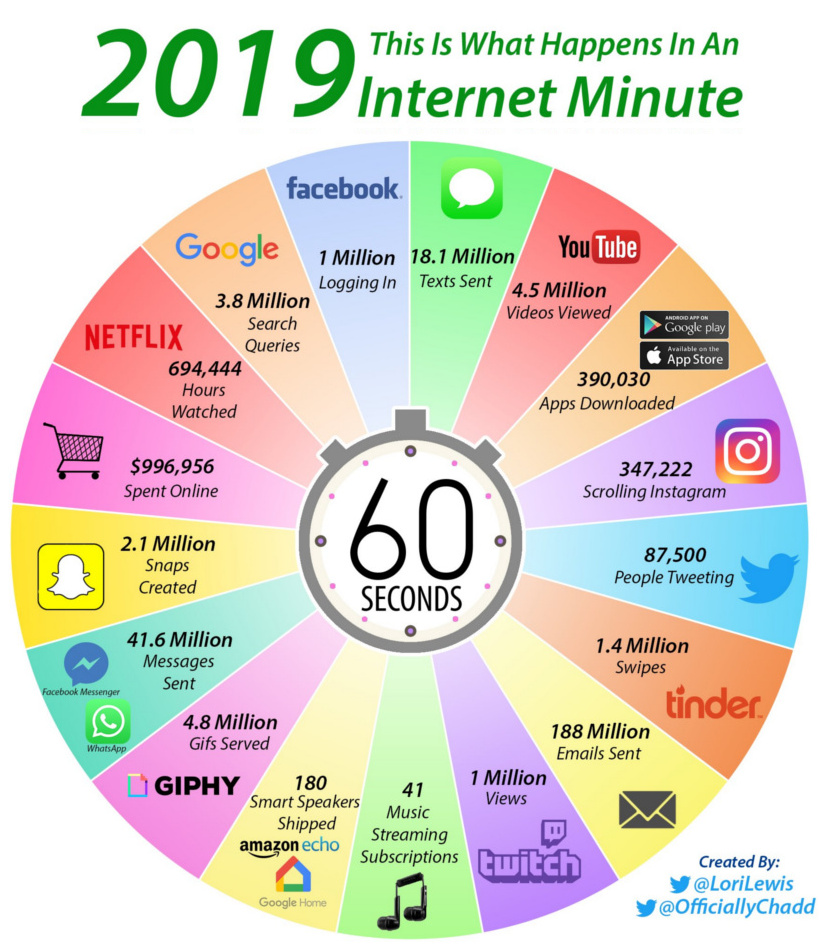
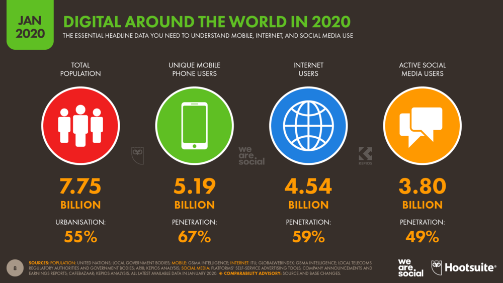
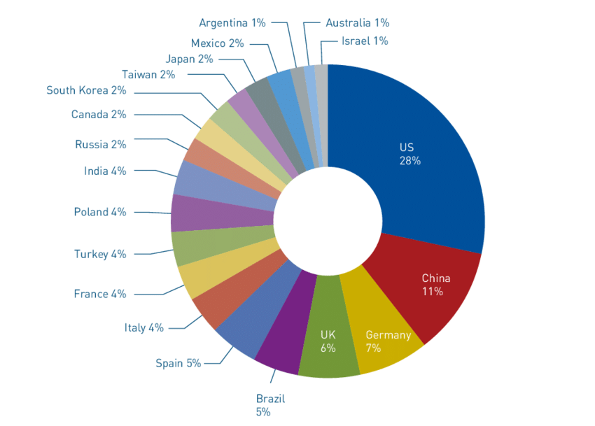

# হ্যাকিং এর প্রাথমিক ধারণা

## হ্যাকিং ও হ্যাকারের প্রকারভেদ

বর্তমান অনলাইন বিশ্বে কয়েক বিলিয়ন মানুষের বসবাস। সেই কয়েক বিলিয়ন মানুষের কয়েক বিলিয়ন তথ্য বা ইনফরমেশন অনলাইনে রয়েছে। এর মাঝে অনেক তথ্য পাবলিক আবার অনেক তথ্য প্রাইভেট। এখন কেউ যদি কোনো ব্যক্তি বা প্রতিষ্ঠানের অনুমতি ছাড়া ঐ ব্যক্তি বা প্রতিষ্ঠানের ইনফরমেশন বা তথ্য চুরি বা ধ্বংস বা মুছে ফেলা বা সাময়িক পরিবর্তন করার উদ্দেশ্যে সেই ব্যক্তির বা প্রতিষ্ঠানের প্রাইভেট অ্যাকাউন্ট বা নেটওয়ার্ক বা সার্ভারে প্রবেশ করে, যা ঐ ব্যক্তি বা প্রতিষ্ঠানের ক্ষতির কারন হয়, তাহলে এই প্রসেসকে হ্যাকিং \(**Hacking**\) বলা হবে। আর যিনি এই প্রক্রিয়াটি পরিচালনা করেন তাকে সহজভাষায় হ্যাকার \(**Hacker**\) বলা হয়।

হ্যাকার মূলত ৩ ধরণের হয়ে থাকে- 

* **Black Hat hacker** 
* **White Hat Hacker** 
* **Grey Hat Hacker**

### ব্ল্যাক হ্যাট হ্যাকার \(Black Hat Hacker\) 

ব্ল্যাক হ্যাট হ্যাকাররা মূলত সাইবার জগতের সমস্ত অপরাধ কর্মকান্ডের সাথে জড়িত থাকে। এই সমস্ত হ্যাকাররা ব্যক্তিস্বার্থের জন্য কাজ করে থাকে। এরা বিভিন্ন সিস্টেম বা নেটওয়ার্কের দুর্বলতা খুঁজে অনুমতিবিহীন কারো সার্ভার বা কম্পিউটারে প্রবেশ করে এবং সেই কম্পিউটার বা সার্ভারে থাকা বিভিন্ন সেনসিটিভ তথ্য হাতিয়ে নেয়। অথবা এরা বিভিন্ন সিস্টেমের ডেটাবেজ নষ্ট বা ধ্বংস করে ফেলে অথবা বিভিন্ন ধরণের ম্যালওয়ার ভাইরাস ছড়ায় অথবা তারা বিভিন্ন ব্যাকডোর সৃষ্টি করে যাতে পরবর্তিতে ঐ সার্ভার বা কম্পিউটারে এক্সেস নিতে পারে, যেটা একজন গ্রাহকের জন্য অনেক ক্ষতির কারন হয়ে থাকে। ব্ল্যাক হ্যাট হ্যাকারদের মাঝেও বিভিন্ন ধরণের প্রকারভেদ রয়েছে যেমন- অনেক হ্যাকার রাষ্ট্রীয় ক্ষতি করে, আবার অনেক হ্যাকার অন্য কোনো দেশের ক্ষতি করে, আবার অনেক হ্যাকার নির্দিষ্ট কমিউনিটিকে উদ্দেশ্য করে কাজ করে। তবে দিনশেষে এই ব্ল্যাক হ্যাট হ্যাকারদের মূল উদ্দেশ্যই থাকে ব্যক্তিস্বার্থ হাসিল।

### হোয়াইট হ্যাট হ্যাকার \(White Hat Hacker\) 

হোয়াইট হ্যাট হ্যাকার হচ্ছে সেই সমস্ত হ্যাকার যারা অনুমতি নিয়ে বিভিন্ন সিস্টেম বা সার্ভারে প্রবেশ করে এবং সেই সিস্টেমের দূর্বলতা খুঁজে বের করে, ঐ সিস্টেমের মালিককে সেই ব্যাপারে অবগত করে, যাতে সেই সিস্টেমটি পরবর্তিতে কোনো সাইবার হামলার শিকার না হয়। হোয়াইট হ্যাট হ্যাকারদের আরেকটি প্রধান বৈশিষ্ট্য হচ্ছে এরা ব্ল্যাক হ্যাট হ্যাকারদের আক্রমণ থেকে বিভিন্ন সেনসিটিভ তথ্যের নিরাপত্তা প্রদান করে। হোয়াইট হ্যাট হ্যাকাররা কখনওই সাইবার ক্রাইমের সাথে সংযুক্ত থাকে না। হোয়াইট হ্যাট হ্যাকাররা প্রত্যেকটি দেশের তাদের সরকারের সাথে কাজ করে অথবা বিভিন্ন প্রতিষ্ঠানের সাথে কাজ করে অথবা ব্যক্তিগতভাবে কাজ করে। এদের প্রধান কাজ হচ্ছে সাইবার ওয়ার্ল্ডের সর্বোচ্চ নিরাপত্তা প্রদান করা। এই ধরণের হ্যাকারদের ইথিক্যাল হ্যাকারও বলে।

### গ্রে হ্যাট হ্যাকার \(Grey Hat Hacker\) 

গ্রে হ্যাট হ্যাকাররা একটু ভিন্ন প্রকৃতির হয়ে থাকে। এরা স্বাধীন বা নিরবিচ্ছিন্নভাবে কাজ করতে পছন্দ করে। এরা কোনো সিস্টেমে অনুমতি ছাড়া শখের বসে প্রবেশ করে এবং সেই সিস্টেমের বিভিন্ন কারিগরি দূর্বলতা গুলো খুঁজে বের করে। এরা ইচ্ছা করলে ঐ সিস্টেমের মালিককে তার সিস্টেমের দূর্বলতা সম্পর্কে অবহিত করতে পারে আবার নাও করতে পারে। এটা সম্পূর্ণ নির্ভর করে তার ইচ্ছাশক্তির উপর। গ্রে হ্যাট হ্যাকাররা চাইলে ঐ সমস্ত সিস্টেমকে ভেঙ্গে দিতে পারে অথবা ঐখান থেকে ডেটা চুরি করতে পারে অথবা ডেটার বিনিময়ে অর্থ চাইতে পারে আবার এরা চাইলে ঐ সিস্টেমের মালিকের সহকারি হতে পারে। তবে এই ধরণের হ্যাকারদের বেশিরভাগ বৈশিষ্ট্য হচ্ছে এরা শখের বসে এইসব কাজ করে থাকে, তাদের উদ্দেশ্য ডেটা চুরি করা বা অর্থ হাতিয়ে নেওয়া নয়। তবে যেহেতু এরা অনুমতিবিহীন কারো সার্ভারে প্রবেশ করে সেহেতু এটি বিপদজনক তাই এদেরকে ব্ল্যাক হ্যাট হ্যাকারও বলা হয় আবার যেহেতু এরা তেমন বিশেষ কোনো ক্ষতি না করে বরং সিস্টেমের মালিককে সেই ব্যাপারে অবগত করছে সেহেতু এরা আবার হোয়াইট হ্যাট হ্যাকারের আওতায়ও পড়ছে। আর এরা যেহেতু ব্ল্যাক হ্যাট হ্যাকার ও হোয়াইট হ্যাট হ্যাকারের মধ্যপন্থী সেহেতু এদের গ্রে হ্যাট হ্যাকার বলা হয়।

এই ছাড়াও আরো বিভিন্ন ধরণের হ্যাকার রয়েছে-

#### নিওফাইট বা নোব \(Neophyte or n00b\)

এরা হচ্ছে একদম বিগিনার লেভেলের অর্থাৎ হ্যাকিং শিক্ষার্থী। এরা বিভিন্ন হ্যাকিং কৌশল, হ্যাকিং টুলস, সফটওয়্যার ও বিভিন্ন প্রযুক্তি নিয়ে প্রাথমিক পড়াশোনা বা জ্ঞানার্জন করে থাকে।

#### স্ক্রিপ্ট কিডি - Script Kiddie

স্ক্রিপ্ট কিডি হ্যাকাররা তেমন কোনো বড় মাপের হ্যাকার না। এদের তেমন ভাল প্রোগ্রামিং দক্ষতা নেই। এরা বিভিন্ন হ্যাকিং টুলস বানাতে পারে না, এরা অন্যের তৈরি টুল দিয়ে হ্যাকিং কার্য সম্পাদন করে থাকে। এমনকি কোনো সিস্টেম হ্যাক বা ক্ষতি করার পর এরা তাদের নিজস্ব আইডেন্টি লুকিয়ে রাখতেও দক্ষ নই।

#### ক্র্যাকার - Cracker

মূলত এই অংশটাকে ব্ল্যাক হ্যাট হ্যাকারও বলা হয়। ক্র্যাকাররা বিভিন্ন ক্ষতিকারক সফটওয়্যার বা টুলস বানাতে সক্ষম। এমনকি এরা বিভিন্ন সিস্টেম বা সার্ভারের এক্সেস ভেঙ্গে ফেলার সক্ষমতা রাখে। এই ধরণের হ্যাকারকে সাইবার জগতে অত্যন্ত গুরুত্বের দেখা হয়।

#### এলিট হ্যাকার - Elite Hackers 

এলিট হ্যাকারদের হ্যাকার জগতের প্রধান বলা হয়। এই শ্রেনীর হ্যাকাররা ছোটখাট হ্যাকিং এর জন্য মোটেও সময় নষ্ট করে না। এরা হ্যাকিং এ ভয়ংকর রকমের দক্ষ হয়ে থাকে। এই পৃথিবীর যে সমস্ত হ্যাকিং টুলস রয়েছে প্রায়ই সবকটি এই শ্রেনীর আবিষ্কার। এরা প্রোগ্রামিং, নেটওয়ার্কিং, ডেটাবেজ, ক্লাউড কম্পিউটিং, আর্টিফিশিয়াল ইন্টেলিজেন্স, বিগ ডাটা ইত্যাদি বিষয়ের উপর বিশদ জ্ঞান রাখেন। এরা হ্যাকিং এর বিভিন্ন নতুন নতুন কৌশল আবিষ্কার করে থাকেন। এছাড়াও তাদের হ্যাকিং দক্ষতা কাজে লাগিয়ে বিভিন্ন গুরুত্বপূর্ণ সমস্যার সমাধান করে থাকেন। এই এলিট শ্রেনীর হ্যাকাররা রাষ্ট্রের বিভিন্ন গুপ্ত বা গোয়েন্দা সংস্থার সাথেই বেশি কাজ করে থাকে। আমি যদি কয়েকজন এলিট শ্রেনীর হ্যাকারের নাম বলতে চাই তাহলে আমাকে বলতে হবে- কেভিন মিটনিক, গ্যারি ম্যাককিনন, মাইকেল কেল্স, অ্যালর্বাট গঞ্জালেজ, অ্যান্ড্রিয়ান লামো ইত্যাদি।

#### হ্যাকটিভিস্ট \(Hacktivist\)

রাজনৈতিক, ধর্মীয় ও সামাজিক পরিবর্তন নিয়ে আসার জন্য হ্যাকটিভিস্ট অনলাইনে বিভিন্ন হ্যাকিং কৌশল প্রয়োগ করে থাকে। এরা ১৯৯৪ সালে “Cult of the Dead Cow” নামে একটি হ্যাকিং গ্রুপের মাধ্যমে আত্মপ্রকাশ করে। এছাড়াও এরা বাকস্বাধীনতা, মানবাধিকার বা তথ্য আন্দোলনের স্বাধীনতার সাথে সম্পর্কিত বিভিন্ন কর্মকান্ডের সাথে সংযুক্ত রয়েছে।

#### রাষ্ট্রীয় হ্যাকার - State/Nation Sponsored Hackers

নাম শুনেই বুঝা যাচ্ছে, এরা কোন প্রকৃতির হ্যাকার। এরা মূলত রাষ্ট্রীয় পরিচালনায় পরিচালিত হয়ে থাকে। রাষ্ট্রের বিভিন্ন সাইবার নিরাপত্তা নিশ্চিত করা, অভ্যন্তরীণ বিভিন্ন অনলাইন ক্রাইমের সমাধান করা, রাষ্ট্রের বিভিন্ন গুরুত্বপূর্ণ ব্যাংক বা ডিজিটাল মাধ্যমের নিরাপত্তা দেওয়া হচ্ছে এই শ্রেনীর প্রধান কাজ।

## হ্যাকিং এর মাধ্যম

সহজকথায়, অনলাইনের সাথে সংযুক্ত সকল প্রকার মেশিন হ্যাকিং এর শিকার হতে পারে। হ্যাকিং আসলে কোন কোন ডিভাইস বা মেশিন বা সার্ভারে হয় তা নির্দিষ্ট করে বলা প্রায়ই অসম্ভব ব্যাপার। বিভিন্ন সার্ভারে যে সমস্ত ইনফরমেশন রয়েছে, সেগুলো হ্যাকিং এর শিকার হতে পারে, বিভিন্ন ব্যাংক সমূহ ও তাদের ATM বুথ গুলা হ্যাকিং এর শিকার হতে পারে, IOT ডিভাইস সমূহ হ্যাকিং এর শিকার হতে পারে, মোবাইল, কম্পিউটার, ট্যাব, স্মার্ট ঘড়ি ইত্যাদি জিনিস গুলো হ্যাকিং এর শিকার হতে পারে অথবা আপনি আপনার মোবাইল বা পিসিতে যে সমস্ত সফটওয়্যার ব্যবহার করছেন, সেইগুলোও হ্যাকিং এর শিকার হতে পারে।

## হ্যাকিং থেকে বাঁচার উপায় 

* ব্যক্তি সচেতনতা কারন এক পরিসংখ্যানের মেজরিটি হ্যাকিং এর শিকার হচ্ছে অসচেতন অনলাইন ব্যবহারকারীরা 
* অপরিচিত কোনো লিংক বা সাইটে প্রবেশ করা থেকে বিরত থাকা 
* সোশালমিডিয়াতে ফরোয়ার্ড সংস্কৃতি ও বিভিন্ন আকর্ষনীয় সাইটে প্রবেশ বন্ধ করা 
* অপরিচিত ফ্রি Wi-Fi পরিহার করা অপরিচিত এপস বা সফটওয়্যার ব্যবহার বন্ধ করা 
* আপনার কম্পিউটার বা সার্ভারে কোনো দূর্বলতা আছে কি না তা চেক করা 
* আপনার জাতীয় পরিচয়পত্র বা পাসপোর্টের ছবি অনলাইনে আপলোড না দেওয়া 
* যেকোনো ব্যক্তির সাথে আপনার অনলাইন রিসোর্স যেমন- ইমেইল, ঠিকানা, সাইট ইত্যাদি দেওয়ার সময় সতর্ক থাকা 
* কোনো অবস্থাতেই আপনার পাসওয়ার্ড কারো সাথে শেয়ার করা যাবে না 
* সবসময় আপনার মোবাইল বা পিসিতে শক্তিশালী পাসওয়ার্ড দিয়ে রাখা, পারলে টু-স্টেপ সিকিউরিটি দেওয়া
* ভিন্ন ভিন্ন সাইটে ভিন্ন ভিন্ন পাসওয়ার্ড ব্যবহার করা 
* আপনার পাসওয়ার্ড এমনভাবে দিতে হবে যাতে এটি সহজেই অনুমান করা না যায় 
* আপনার সিস্টেমের নিরাপত্তার জন্য পেইড এন্টিভাইরাস ব্যবহার করা, কোনো অবস্থাতেই ফ্রি কিছু ব্যবহার করা যাবে না 
* সবসময় আপনার সিস্টেমটি আপডেট রাখা 
* আপনি যখন আপনার পিসি অথবা মোবাইল সেল করবেন, তার আগে অবশ্যই আপনার সকল ট্রেস মুছে দিবেন 
* আপনার গুরুত্বপূর্ণ ডেটার সবসময় ব্যাকআপ রাখবেন 
* আপনার অধীনস্থ যারা রয়েছে তাদের সাইবার সিকিউরিটি নিয়ে অবগত করা যখন 
* আপনার পিসির কাজ শেষ হয়ে যাবে, তখন অবশ্যই এটির ইন্টারনেট সংযোগ বিচ্ছিন্ন করে দিতে হবে

## হ্যাকিং এর জন্য কি কি জানতে হয়?

হ্যাকিং এর জন্য কি কি জানতে হবে বা শিখতে হবে এই ধরণের বাঁধাধরা কোনো নিয়ম নেই। প্রযুক্তি আপনি যত ভাল জানবেন, তত ভাল হ্যাকার হতে পারবেন। এটা সম্পূর্ন নির্ভর করে আপনার উপর, আপনি কতটা ভাল হ্যাকার হতে চান সেটার উপর। তারপরেও হ্যাকিং এর জন্য কিছু নির্দিষ্ট জিনিস আপনাকে অবশ্যই জানা বা শিখা প্রয়োজন। যেগুলোর মাঝে প্রধান হচ্ছে-

* কম্পিউটার বেসিক স্কিল সম্পর্কে অবশ্যই আপনাকে ভাল ভাবে জানতে হবে 
* কম্পিউটার নেটওয়ার্কিং সম্পর্কে ভাল ধারনা থাকতে হবে 
* বিভিন্ন অপারেটিং সিস্টেম সম্পর্কে জানতে হবে 
* কম্পিউটার প্রোগ্রামিং সম্পর্কে জানতে হবে 
* ডাটাবেজ ম্যানেজমেন্ট সম্পর্কে জানতে হবে 
* ইন্টারনেট সার্চ ইঞ্জিন সম্পর্কে বিশদ জ্ঞান থাকা চাই 
* গুগল ডর্ক ও এডভান্স কিওয়ার্ড সম্পর্কে জানতে হবে 
* ওয়্যারলেস টেকনোলজি, স্ক্রিপ্টিং, ওয়েব অ্যাপ্লিকেশন, ক্রিপ্টোগ্রাফি সম্পর্কে বিশদ জ্ঞান থাকা চাই 
* কম্পিউটার ফরেনসিক রিভার্স ইঞ্জিনিয়ারিং, সোশ্যাল ইঞ্জিনিয়ারিং ইত্যাদি নিয়েও বিশদ জ্ঞান থাকা চাই 
* একজন ভাল হ্যাকারের যে সমস্ত গুণ রয়েছে সেগুলোর মাঝে ধৈর্য্য, ইচ্ছাশক্তি, প্রবল আগ্রহ, পর্যবেক্ষণ ক্ষমতা, লক্ষবস্তুকে ছোট করে না দেখা ইত্যাদি প্রধান

## ইথিক্যাল হ্যাকিং এর ধারণা

ইথিক্যাল হ্যাকিং হচ্ছে নৈতিক বা বৈধ হ্যাকিং অর্থাৎ যে ধরণের হ্যাকিং এ নির্দিষ্ট কিছু নিয়মনীতি বা নৈতিকতা রয়েছে সে সমস্ত হ্যাকিংকে ইথিক্যাল হ্যাকিং বলা যায়। আমরা পূর্বে জেনেছি বিভিন্ন ধরণের হ্যাকারের বৈশিষ্ট্য নিয়ে, আমরা জেনেছি অনেক হ্যাকার অনুমতিবিহীন কারো সার্ভারে প্রবেশ করে, ওই সার্ভারের সিস্টেমকে ভেঙ্গে সেখান থেকে তথ্য হাতিয়ে নেই আবার অনেক হ্যাকার অনুমতি নিয়ে সেই সিস্টেমের বিভিন্ন দূর্বলতা খুঁজে বের করে, কর্তৃপক্ষকে অবগত করে সেই ব্যাপারে। অর্থাৎ এই ধরণের হ্যাকারের বিভিন্ন নৈতিকতা রয়েছে আর এই ধরণের হ্যাকারদেরকেই ইথিক্যাল হ্যাকার বলা হয়। আবার অনেকে একে হোয়াইট হ্যাট হ্যাকার নামেও জেনে থাকে। ইথিক্যাল হ্যাকাররা বিভিন্ন কোম্পানি বা প্রতিষ্ঠানের হয়ে যখন কাজ করে, তখন তারা সেই কোম্পানি বা প্রতিষ্ঠানের সর্বোচ্চ নিরাপত্তা দিয়ে থাকে। যেকোনো ধরণের ম্যালিসিয়াস হ্যাকারের আক্রমণ থেকে কোম্পানির ডেটার নিরাপত্তা প্রদান করে থাকে। 

বর্তমানে যেহেতু বিশ্বব্যাপী ডিজিটাল যুগে প্রবেশ করেছে, তাই এই যুগের প্রধান হাতিয়ার হচ্ছে ডেটা আর এই ডেটার নিরাপত্তার জন্য প্রতিবছর বিলিয়ন ডলার খরচ করা হয়। তাই খুব আগ্রহের সাথে বলা যায় এথিক্যাল হ্যাকারের চাহিদা কখনই কমবে না।

### হ্যাকিং শিখার ওয়েবসাইট

যারা ইংরেজিতে হ্যাকিং শিখতে আগ্রহী তারা চাইলে নিচের সাইট গুলোও লক্ষ করতে পারেন।

* [http://www.criticalsecurity.net/](http://www.criticalsecurity.net/)
* [https://www.hackthissite.org/](https://www.hackthissite.org/) 
* [http://www.hackers.nl/](http://www.hackers.nl/) 
* [http://www.elite-hackers.com/](http://www.elite-hackers.com/) 
* [http://www.ethicalhacker.net/](http://www.ethicalhacker.net/) 
* [https://www.cybrary.it/](https://www.cybrary.it/)
* [http://www.securitytube.net/](http://www.securitytube.net/) 
* [https://www.tutorialspoint.com/ethical\_hacking](https://www.tutorialspoint.com/ethical_hacking) 
* [https://www.eccouncil.org/programs/certified-ethical-hacker-ceh/](https://www.eccouncil.org/programs/certified-ethical-hacker-ceh/)

## সাইবার ক্রাইম ও ক্রিমিনাল

বর্তমান অনলাইন বিশ্বে অগণিত মানুষের পদচারণা রয়েছে। এই অগনিত মানুষের অসীম তথ্য অনলাইনে বিস্তৃতি রয়েছে আর এই তথ্যের উপর ভিত্তি করে অসংখ্য অপরাধ কর্মকান্ড সংগঠিত হচ্ছে। ইন্টারনেটে প্রতি এক মিনিটে মিলিয়ন গুগল সার্চ, মিলিয়ন টেক্সট, মিলিয়ন লগইন বিভিন্ন মাধ্যমে হয়ে থাকে। প্রতি ১ মিনিটে অনলাইনে কি হয়ে থাকে, তার একটা ধারণা নিচের ছবিটি থেকে পেতে পারেন-

আর নিচের ছবিটি থেকে এই বিশ্বে কি পরিমান জনসংখ্যা রয়েছে, কি পরিমান মোবাইল ব্যবহারকারি রয়েছে, কি পরিমান ইন্টারনেট ব্যবহারকারি রয়েছে এবং তারা সামাজিক যোগাযোগ মাধ্যমে কি পরিমান এক্টিভ থাকে তার একটা পরিসংখ্যান বুঝতে পারবেন।

### সাইবার অপরাধ

সাইবার অপরাধ হচ্ছে এমন এক ধরণের অপরাধ, যে অপরাধের সাথে প্রত্যক্ষ বা পরোক্ষভাবে ইলেক্ট্রনিক ডিভাইস ও ইন্টারনেট সংযুক্ত থাকে। অর্থাৎ ডিজিটাল মাধ্যমে যে কোনো ধরণের অপরাধই সাইবার অপরাধ। সাইবার অপরাধ হতে পারে ইচ্ছাকৃতভাবে কাউকে হুমকি দেওয়া, কারো ব্যক্তিগত তথ্য ফাঁস করা, কারো অনলাইন রিসোর্স চুরি করা, স্প্যামিং করা, কাউকে হত্যার হুমকি দেওয়া, কাউকে ব্লাকমেইল করা, অশ্লীল বা আপত্তিকর বিষয়বস্তু, কপিরাইট আইন লঙ্ঘন করা ইত্যাদি ইত্যাদি। 

পৃথিবীর প্রত্যেকটা দেশে এই সাইবার ক্রাইম রয়েছে এবং প্রত্যেকটা দেশে এই সাইবার অপরাধের জন্য আলাদা আলাদা আইন রয়েছে, সাজা রয়েছে। বাংলাদেশেও সাইবার অপরাধ লঙ্ঘন করলে বিভিন্ন ধরণের আইন ও সাজা রয়েছে। বিশ্বের সবচেয়ে বেশি সাইবার অপরাধ যে দেশ গুলো সংগঠিত হয়ে থাকে এর তালিকা--

**সাইবার অপরাধের তিন ধরণের ক্যাটাগরি রয়েছে-** 

**Cyber Crime against People:** এই ক্যাটাগরিতে সাইবার হ্যারেজমেন্ট করা, কাউকে হুমকি দেওয়া, কারো ব্যক্তিগত তথ্য ফাঁস করা, কারো অনলাইন রিসোর্স চুরি করা, শিশু পর্নোগ্রাফি ছড়ানো, অনলাইন প্রতারণা করা ইত্যাদি হয়ে থাকে।

**Cyber Crime against Property:** এই ক্যাটাগরিতে DDOS attacks, hacking, virus transmission, cyber and typo squatting, computer vandalism, copyright infringement, and IPR violations, Cyber Squatting ইত্যাদি হয়ে থাকে।

**Cyber Crime against Government:** আর যখন কোনো সাইবার ক্রাইম কোনো সরকারের বিরুদ্ধে করা হয়, তখন এটিকে সেই দেশের সার্বভৌমত্বের উপর আক্রমণ ধরা হয়। এই ক্যাটাগরিতে হ্যাকিং, গোপনীয় তথ্য অ্যাক্সেস, সাইবার ওয়ারফেয়ার, সাইবার সন্ত্রাসবাদ ইত্যাদি হয়ে থাকে। এছাড়াও Crime against Society নামে আরেকটি ক্যাটাগরি রয়েছে যেখানে কোনো জাতি বা সংস্থাকে উদ্দেশ্য করে অপরাধ করা হয়।

### বাংলাদেশে সাইবার অপরাধের আইন ও সাজা

তথ্য ও যোগাযোগ প্রযুক্তি আইনের ৫৬ ধারায় বলা আছে--

> _“যদি কোনো ব্যক্তি জনসাধারণের বা কোনো ব্যক্তির ক্ষতি করার উদ্দেশ্যে বা ক্ষতি হবে মর্মে জানা সত্ত্বেও এমন কোনো কাজ করেন, যার ফলে কোনো কম্পিউটার রিসোর্সের কোনো তথ্যবিনাশ, বাতিল বা পরিবর্তিত হয় বা তার মূল্য বা উপযোগিতা হ্রাস পায় বা অন্য কোনোভাবে একে ক্ষতিগ্রস্ত করে\| এমন কোনো কম্পিউটার সার্ভার, কম্পিউটার নেটওয়ার্ক বা অন্য কোনো ইলেকট্রনিক সিস্টেমে অবৈধভাবে প্রবেশ করার মাধ্যমে এর ক্ষতিসাধন করেন, কিন্তু তিনি মালিক বা দখলদার নন, তাহলে তাঁর এই কাজ হবে একটি হ্যাকিং অপরাধ\| কোনো ব্যক্তি হ্যাকিং অপরাধ করলে তিনি অনূর্ধ্ব ১০ বছর কারাদণ্ডে দণ্ডিত হবেন \| এক কোটি টাকা অর্থদণ্ডে দণ্ডিত হতে পারেন বা উভয়দণ্ড দেওয়া যেতে পারে \|”_

 তথ্যপ্রযুক্তি আইনের ৫৭ ধারায় বলা আছে--

> “যদি কোনো ব্যক্তি ইচ্ছাকৃতভাবে ওয়েবসাইটে বা অন্য কোনো ইলেকট্রনিক বিন্যাসে এমন কিছু প্রকাশ বা সম্প্রচার করেন যা মিথ্যা ও অশ্লীল বা সংশ্লিষ্ট অবস্থা বিবেচনায় কেউ পড়লে বা শুনলে নীতিভ্রষ্ট বা অসৎ হতে উদ্বুদ্ধ হতে পারে বা যার দ্বারা মানহানি ঘটে, আইনশৃঙ্খলার অবনতি ঘটে বা ঘটার সম্ভাবনা সৃষ্টি হয়, রাষ্ট্র বা ব্যক্তির ভাবমূর্তি ক্ষুণ্ন হয় বা ধর্মীয় অনুভূতিতে আঘাত করে বা করতে পারে বা এ ধরনের তথ্যাদির মাধ্যমে কোনো ব্যক্তি বা সংগঠনের বিরুদ্ধে উস্কানি প্রদান করা হয়, তাহলে তার এই কাজ অপরাধ বলে গণ্য হবে \|”

### কিছু সাইবার অপরাধের আইন ও সাজা

* কেউ যদি বেআইনিভাবে কারও ওয়েবসাইটে প্রবেশ করে তাহলে তাকে সাত বছরের জেল ও ২৫ লাখ টাকা জরিমানা অথবা উভয় দণ্ড দেওয়া হবে
* কেউ যদি কারও কম্পিউটারের সোর্স কোড পরিবর্তন বা ধ্বংস করে তাহলে তিন বছরের জেল ও তিন লাখ টাকা জরিমানা বা উভয় দণ্ড দেওয়ার বিধান রাখা হয়েছে। 
* কেউ যদি ডিজিটাল মাধ্যম ব্যবহার করে মুক্তিযুদ্ধ, মুক্তিযুদ্ধের চেতনা এবং জাতির জনক বঙ্গবন্ধুকে নিয়ে কোনও ধরনের প্রপাগান্ডা চালায় তাহলে ১৪ বছরের জেল ও এক কোটি টাকা জরিমানা বা উভয় দণ্ড দেওয়ার বিধান রাখা হয়েছে আইনটিতে।
* কেউ যদি ধর্মীয় বোধ ও অনুভূতিতে আঘাত করে তাহলে তাকে ১০ বছরের জেল ও ২০ লাখ টাকা জরিমানা বা উভয় দণ্ড দেওয়ার বিধান রাখা হয়েছে 
* না জানিয়ে কোনও ইলেকট্রনিক্স ডিভাইস ব্যবহার করে ব্যাংক-বীমায় ই-ট্রানজেকশন করলে পাঁচ বছরের জেল ও পাঁচ লাখ টাকা জরিমানা বা উভয় দণ্ডের বিধান রাখা হয়েছে। 
* ডিজিটাল মাধ্যম ব্যবহার করে কেউ অরাজকতা সৃষ্টি করলে সাত বছরের জেল ও পাঁচ লাখ টাকা জরিমানা বা উভয় দণ্ডের বিধান রাখা হয়েছে। 
* ৩২ ধারায় বলা হয়েছে, সরকারি, আধাসরকারি, স্বায়ত্তশাসিত প্রতিষ্ঠানে কেউ যদি বেআইনিভাবে প্রবেশ করে কোনও ধরনের তথ্য উপাত্ত যে কোনও ধরনের ইলেকট্রনিক্স যন্ত্রপাতি দিয়ে গোপনে রেকর্ড করে তাহলে সেটা গুপ্তচরবৃত্তির অপরাধ হবে। এর জন্য ১৪ বছরের জেল ও ২০ লাখ টাকা জরিমানা বা উভয় দণ্ডের বিধান রাখা হয়েছে।

**পরবর্তি অধ্যায়ে আমরা হ্যাকিং এর বিভিন্ন টুলস নিয়ে আলোচনা করবো। কিভাবে ডাউনলোড দিতে, কিভাবে ইন্সটল দিতে হয়, কিভাবে ব্যবহার করতে হয় ইত্যাদি ইত্যাদি।**  

