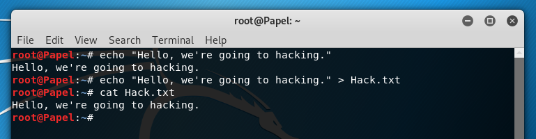

# কালি লিনাক্স কমান্ড

হ্যাকিং এর জন্য যেমন কালি লিনাক্সের কোনো বিকল্প নেই তেমনি কালি লিনাক্স অপারেটিং সিস্টেম পরিচালনার জন্য সবচেয়ে গুরুত্বপুর্ন হচ্ছে কালি লিনাক্স কমান্ডস। এই চাপ্টারে আমরা এই কালি কমান্ডস নিয়ে বিস্তারিত আলোচনা করব।

### uname Command

**uname** কমান্ডের মাধ্যমে আপনার অপারেটিং সিস্টেম ও সিস্টেম হার্ডওয়ার সম্পর্কে বেসিক তথ্য সমূহ দেখতে পাবেন। **uname -a** কমান্ডের মাধ্যমে Kernel Name, Node Name, Kernel Release, Kernel Version, Machine, Processor, Hardware Platform এবং Operating system সম্পর্কে বিস্তারিত জানতে পারবেন। হেল্পের জন্য **uname --help** লিখে এন্টার দিতে হবে।

```java
Command: uname -a | Help: uname --help
```


### users Command

সিস্টেমে কোন ইউজার লগিন নিয়েছে তা জানার জন্য **users** কমান্ডটি ব্যবহার করা হয়।

```java
Command: users
```


### whoami Command

**whoami** কমান্ডটি মূলত ইউজার আইডি চেক করার জন্য ব্যবহৃত হয়। হেল্পের জন্য **whoami --help** কমান্ড ব্যবহার করে বিস্তারিত জানতে পারবেন।

```java
Command: whoami | Help: whoami --help
```


### arch Command

কম্পিউটারের আর্কিটেকচার সম্পর্কে জানার জন্য **arch** কমান্ড ব্যবহার করা হয়। এই কমান্ডটি **i386, i486, i586, alpha, arm, m68k, mips, sparc, x86\_64** এইরকম জিনিস প্রিন্ট করবে, আপনার কম্পিউটারের ধরন অনুযায়ী।

```java
Command: arch
```


### date Command

ডেইট কমান্ড ব্যবহার করা হয় তারিখ ও সময় দেখার জন্য। লিনাক্স টার্মিনালে **date** লিখে এন্টার ক্লিক করলে বর্তমান সিস্টেম সময় ও তারিখ দেখাবে। এমনকি সপ্তাহ, মাস, টাইমজোন ও বছরের তথ্য দেখাবে।

```java
Command: date
```


আপনি চাইলে কাস্টম তারিখ ও সময় সেট করে দিতে পারেন নিচের কমান্ড ব্যবহার করে।

```java
Command: date --set='2 Apr 2020 18:10'
```

**Date** কমান্ড নিয়ে বিস্তারিত তথ্য ও হেল্পের জন্য **date --help** কমান্ড ব্যবহার করে জানতে পারবেন।

### cal Command

**cal** কমান্ড দিয়ে বর্তমান মাসের একটি ফরম্যাট টার্মিনালে প্রিন্ট করানো যায়। লিনাক্স টার্মিনালে **cal** লিখে এন্টার ক্লিক করলে বর্তমান মাসের একটি ফরম্যাট লিনাক্স টার্মিনালে প্রিন্ট হবে। 

```java
Command: cal
```


### pwd Command

**pwd** এর মানে হচ্ছে “**Print Working Directory**” অর্থাৎ আমরা লিনাক্সের কোন ফোল্ডার বা জায়গায় অবস্থান করছি তা জানার জন্য এই কমান্ডটি ব্যবহার করা হয়।

```java
Command: pwd
```


### ls Command 

**ls** কমান্ড হচ্ছে লিনাক্সের সবচেয়ে বেশি ব্যবহৃত একটি কমান্ড। **ls** কমান্ড এর মাধ্যমে কোনো ফোল্ডারের যত ফাইল, ডিরেক্টরি রয়েছে তা সহজেই খুঁজে বের করা যায়। 

```java
Command: ls
```


কোনো ডিরেক্টরির সব হিডেন ফাইল বের করার জন্য **ls** এর সাথে **-a** যুক্ত করে অর্থাৎ **ls -a** কমান্ডটি ব্যবহার করতে হবে। হেল্পের জন্য টার্মিনালে **ls --help** লিখলে বিস্তারিত তথ্য চলে আসবে।

```java
Command: ls -a | Help: ls --help
```

### cd Command

**cd** এর মানে হচ্ছে "**Change Directory**" অর্থাৎ আমাদের সবসময় এক ডিরেক্টরি থেকে আরেক ডিরেক্টরিতে যেতে হয় মানে সুইচিং করতে হয়। এই সুইচিং বা ডিরেক্টরি পরিবর্তন করার জন্য **cd** কমান্ড ব্যবহার করা হয়। আর পূর্বের ডিরেক্টরিতে ফিরে যাওয়ার জন্য **cd ..** \(ডট ডট\) ব্যবহার করা হয়।

```java
Command: cd
```


### mkdir Command

**mkdir** কমান্ড দিয়ে নতুন একটি ডিরেক্টরি তৈরি করা হয়। লিনাক্সে কাজ করার সময় আমাদের প্রায়ই নতুন নতুন ডিরেক্টরি বা ফোল্ডার তৈরি করতে হয় আর এই জন্য **mkdir** কমান্ডটি ব্যবহার করতে হয়। নিচে **mkdir** এরপর স্পেস দিয়ে **Papel** নামে একটি ডিরেক্টরি তৈরি করা হয়েছে। 

```java
Command: mkdir Papel
```


### cat Command

কোনো ফাইলের ভিতরে কি টেক্সট বা লেখা আছে, তা জানার জন্য **cat** কমান্ডটি ব্যবহার করা হয়। আর কোনো ফাইল তৈরি করার জন্য **cat &gt; \(filename\)** কমান্ডটি ব্যবহৃত হয়।

```java
Command: cat papel.txt
```


### cp Command

লিনাক্সে কোনো কিছু কপি করার জন্য **cp** কমান্ডটি ব্যবহৃত হয়। **cp** কমান্ডের পর ফাইল বা ডিরেক্টরির নাম এরপর ঐ ফাইলটির ডেস্টিনেশন পাথটি দিয়ে এন্টার দিলেই ফাইলটি কপি হয়ে যাবে। হেল্পের জন্য **cp --help** লিখে এন্টার দিতে হবে। 

```java
Command: cp | Help: cp --help
```


### mv Command

লিনাক্সে এক ডিরেক্টরি থেকে আরেক ডিরেক্টরিতে কোনো কিছু সরিয়ে নিয়ে যাওয়ার জন্য **mv** কমান্ড ব্যবহার করা হয়।

```java
Command: mv file (destination path)  
```


### rm Command

লিনাক্সের কোনো কিছু রিমুভ বা ডিলেট করার জন্য **rm** কমান্ড ব্যবহার করা হয়। হেল্পের জন্য **rm --help** লিখে এন্টার দিতে হবে। প্রথমে **rm** লিখে তারপর ফাইলটির নাম দিলেই ফাইলটি রিমুভ হয়ে যাবে। যেমন- 

```java
Command: rm papel.txt | Help: rm --help
```


### uptime Command

আপনার ব্যবহৃত সিস্টেমটি কতক্ষণ ধরে চালু আছে, তা জানার জন্য **uptime** কমান্ডটি ব্যবহার করা হয়। সময়টা হিউম্যান-রিডেবল ফরম্যাটে দেখতে চাইলে **uptime -p** কমান্ডটি ব্যবহার করতে হবে। হেল্পের জন্য **uptime --help** লিখে এন্টার দিতে হবে।

```java
Command: uptime -p | Help: uptime --help
```


### sort Command

কোনো ফাইলের কনটেন্টকে লাইন-বাই-লাইন সর্টিং এর জন্য **sort** কমান্ডটি ব্যবহার করা হয়। রিভার্স সর্টিং এর জন্য **sort -r** ব্যবহার করা হয়। হেল্পের জন্য **sort --help** লিখে এন্টার দিতে হবে।

```java
Command: sort (file) | Help: sort --help
```


### free Command

আমাদের লিনাক্স মেশিনে কি পরিমান র‍্যাম খালি রয়েছে এবং কি পরিমান পিজিক্যাল মেমোরি ব্যবহৃত হয়েছে ইত্যাদি তথ্য পাওয়া যাবে **free** কমান্ড ব্যবহার করে। হেল্পের জন্য **free --help** লিখে এন্টার দিতে হবে।

```java
Command: free | Help: free --help
```


### dig command

কালি লিনাক্স টার্মিনালের মাধ্যমে কোনো ওয়েবসাইটের **DNS lookup** চেক করার জন্য **dig** কমান্ডটি ব্যবহার করা হয়। d**ig** এর মানে হচ্ছে **Domain Information Groper**.

```java
Command: dig (site)
```


### echo command

কালি লিনাক্সের খুবই গুরুত্বপুর্ন এই **echo** কমান্ডটি। এটি কোনো মেসেজ প্রিন্ট বা আউটপুট দেখানোর জন্য ব্যবহৃত হয়।

```java
Command: echo (your message)
```



### apt-get command

**apt-get** হল একটি প্যাকেজ ম্যানেজার যা প্যাকেজ ইনস্টল, অপসারণ, শুদ্ধিকরণ এবং আপডেট করতে ব্যবহৃত হয়। **apt-get** লিনাক্সের সবচেয়ে গুরুত্বপূর্ন একটি কমান্ড।

```java
Command: apt-get (update/upgrade/install)
```


### useradd command

কালি লিনাক্সে নতুন কোনো ইউজার একাউন্ট সংযুক্ত করার জন্য **useradd** কমান্ড ব্যবহার করা হয়। প্রথমে **useradd** লিখে স্পেস দিয়ে ইউজার নাম দিয়ে এন্টার দিতে হবে। তারপর পাসওয়ার্ড এর অপশন এর জন্য **passwd** কমান্ড লিখে পাসওয়ার্ড দিয়ে এন্টার দিলেই নতুন একাউন্ট তৈরি হয়ে যাবে।

```java
Command: useradd Papel
Command: passwd papel
```


### passwd command

আপনার কালি লিনাক্স অপারেটিং সিস্টেমের যেকোনো পাসওয়ার্ড পরিবর্তন করার জন্য এই **passwd** কমান্ডটি ব্যবহৃত হয়ে থাকে। লিনাক্স টার্মিনালে **passwd** লিখে এন্টার দিলে প্রথমে **New password:** এর অপশন আসবে, যেখানে আপনার পাসওয়ার্ডটি দিতে হবে তারপর এন্টার দিলে পুনরায় **Retype new password:** আসবে তারপর আবার আপনার পাসওয়ার্ডটি দিয়ে এন্টার দিলেই নতুন পাসওয়ার্ড সেট হয়ে যাবে।

```java
Command: passwd
New password: (your password)
Retype New password: (your password)
```


### unzip command

কালি লিনাক্সে অনেক ফাইল জিপ ফাইল অবস্থায় থাকে আর এই সকল ফাইলকে আনজিপ করার জন্য **unzip** কমান্ডটি ব্যবহার করা হয়। আবার কোনো ফাইলকে জিপ ফাইল বানানোর জন্য **zip** কমান্ড ব্যবহার করা হয়।

```java
Command: unzip papel.zip
Command: zip papel.txt sajib.txt hello.txt
```


### history Command

আমাদের লিনাক্স টার্মিনাল ব্যবহার করে যত কমান্ড দিয়ে কাজ করা হয়েছে, তা একসাথে দেখার জন্য **history** কমান্ড ব্যবহার করা হয়।

```java
Command: history
```


### clear command

আমাদের কালি লিনাক্স টার্মিনাল স্ক্রিনের পূর্বের সকল কমান্ড ও আউটপুট মুছে ফেলার জন্য **clear** কমান্ড ব্যবহার করা হয়।

```java
Command: clear
```


