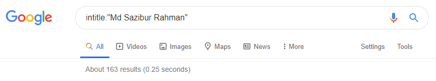
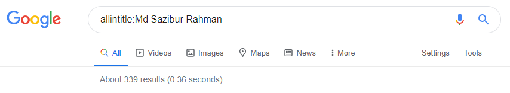
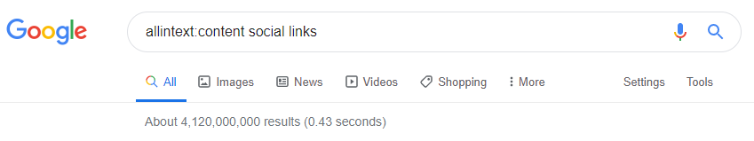
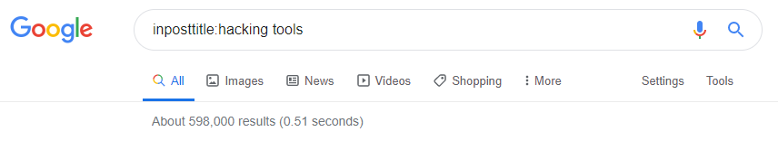
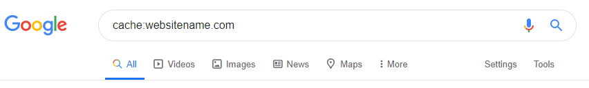
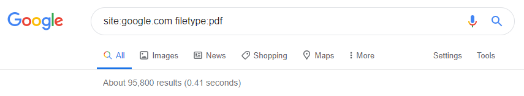

# সোশ্যাল মিডিয়া ও সার্চিং আইডিয়া

**হ্যাকিং** এর মূল উদ্দেশ্য হচ্ছে বিভিন্ন ধরণের ইনফরমেশন বা তথ্য হাতিয়ে নেওয়া। সেই তথ্য বা ইনফরমেশন হতে পারে রাষ্ট্রীয়, হতে পারে ব্যক্তিগত বা জাতিগত। আর আমরা আমাদের ব্যক্তিগত বিভিন্ন তথ্য সোশ্যাল মিডিয়াতে সচারচর দিয়ে থাকি। কোনো হ্যাকার যখন কাউকে টার্গেট করে, প্রথমেই সেই টার্গেটের বিভিন্ন সাধারন তথ্য নিয়ে এনালাইসিস করে থাকে। আর হ্যাকারের এনালাইসিসের জন্য প্রথম পছন্দ হচ্ছে সোশ্যাল মিডিয়ার সাইট সমূহ। কেননা আমরা এই সাইট সমূহে আমাদের ব্যক্তিগত তথ্যসমূহ সরবরাহ করে থাকি যেমন- নাম, জন্মসাল, ঠিকানা, ব্যক্তিগত ছবি, প্রাইভেট মূহুর্ত, কোথায় আছি, কি করছি, জাতীয় পরিচয়পত্রের ছবি এমনকি পাসপোর্টের কপিও আপলোড দিয়ে থাকি, যেগুলা একজন হ্যাকারের জন্য ঈদ লাগার মত আনন্দের ব্যাপার।

## সোশ্যাল মিডিয়া  

পৃথিবীর মোট জনসংখ্যার 49% জনগণ সোশ্যাল মিডিয়া ব্যবহার করে, অর্থাৎ 3.8 বিলিয়ন একটিভ ব্যবহারকারী রয়েছে সামাজিক যোগাযোগ মাধ্যমগুলোতে। বেশিরভাগ সামাজিক মাধ্যম গুলো অল্প বয়স্ক লোকেরা ব্যবহারের অনুমতি পায় না। তবে যারা এই মাধ্যমগুলো ব্যবহার করে তাদের এভারেজ ব্যবহারকারীর মিনিমাম ৮টি বিভিন্ন সামাজিক মাধ্যমে একাউন্ট রয়েছে, যেখানে তারা দিনে প্রায়ই ২ ঘন্টা ২৪ মিনিটের বেশি সময় ব্যয় করে থাকে।

[ডাটা রিপোর্টালের](%20https://datareportal.com/social-media-users) তথ্য অনুযায়ী, ফেইসবুকে প্রতিমাসে একটিভ ইউজার রয়েছে 2.45 billion, ইউটিউবে রয়েছে 2.00 billion, হোয়াটসআপে রয়েছে 1.60 billion, মেসেঞ্জারে রয়েছে 1.30 billion, চীনের উইচ্যাটে রয়েছে 1.15 billion, ইন্সট্রাগ্রামে রয়েছে 1 billion, টিকটকে রয়েছে 800 million, কিউকিউ তে রয়েছে 731 million, টুইটারে রয়েছে 340 million।

### বিভিন্ন জনপ্রিয় সোশ্যাল মিডিয়া

* **Draugiem** \(Latvia\) [https://www.draugiem.lv](https://www.draugiem.lv)
* **Facebook** [https://www.facebook.com/](https://www.facebook.com/)
* **Facenama** \(Iran\) [ http://facenama.com 
  ](%20http://facenama.com%20
  )
* **Instagram** [https://www.instagram.com 
  ](https://www.instagram.com%20
  )
* **LinkedIn** [ ****https://www.linkedin.com 
  ](%20https://www.linkedin.com%20
  )
* **Mixi** \(Japan\) [https://mixi.jp 
  ](https://mixi.jp%20
  )
* **Odnoklassniki** \(Russia\) [http://ok.ru 
  ](http://ok.ru%20
  )
* **Pinterest** [http://www.pinterest.com 
  ](http://www.pinterest.com%20
  )
* **Qzone** \(China\) [http://qzone.qq.com 
  ](http://qzone.qq.com%20
  )
* **Reddit** [https://www.reddit.com 
  ](https://www.reddit.com%20
  )
* **Taringa** \(Latin America\) [http://www.taringa.net 
  ](http://www.taringa.net%20
  )
* **Tinder** [https://www.gotinder.com 
  ](https://www.gotinder.com%20
  )
* **Tumblr** [https://www.tumblr.com 
  ](https://www.tumblr.com%20
  )
* **Twitter** [https://twitter.com 
  ](https://twitter.com%20
  )
* **Weibo** \(China\) [http://weibo.com 
  ](http://weibo.com%20
  )
* **VKontakte** [https://vk.com 
  ](https://vk.com%20
  )
* **Xing** [https://www.xing.com](https://www.xing.com)

### সোশ্যাল মিডিয়ায় নিরাপত্তা

* Uppercase, Lowercase, Numbers, Special Character ব্যবহার করে শক্তিশালী পাসওয়ার্ড ব্যবহার করা 
* প্রতিটা সোশ্যাল একাউন্টে আলাদা আলাদা পাসওয়ার্ড ব্যবহার করা 
* যে সকল সোশ্যাল মিডিয়াতে security answers অপশন রয়েছে, সেগুলো ব্যবহার করা 
* প্রতিটা একাউন্টে Mail Recovery অপশন ব্যবহার করা 
* সোশ্যাল মিডিয়াতে পিশিং সাইট গুলো সবচেয়ে বেশি ছড়ানো থাকে তাই অপরিচিত যেকোনো সাইটের লিংকে ক্লিক করা থেকে বিরত থাকা 
* আপনার সেনসিটিভ ব্যক্তিগত তথ্য শেয়ার করা থেকে অবশ্যই বিরত থাকুন 
* থার্ড পার্টি কোনো সাইটে আপনার সোশ্যাল ক্রিডেনশিয়াল ব্যবহার করবেন না 
* আপনার সোশ্যাল মিডিয়া সাইটের পাসওয়ার্ড কোনো অবস্থাতেই কাউকে দেওয়া থেকে বিরত থাকুন
* সোশ্যাল মিডিয়াতে অনেক সময় বিভিন্ন কুইজ ও গেমসে আপনার সোশ্যাল একাউন্টের লগিন এক্সেস চাইলে এইগুলা পরিহার করুন 
* আপনার যদি কোনো অপ্রাপ্ত বয়স্ক সন্তান সোশ্যাল সাইট ব্যবহার করে, তাহলে সেই একাউন্ট গুলোর প্রতি বিশেষ লক্ষ্য রাখুন 
* বিভিন্ন সময় অনেক মেসেজ ফরওয়ার্ড করতে বলা হলে এইগুলা পরিহার করুন 
* সোশ্যাল মিডিয়াতে কারো ফ্রেন্ড রিকুয়েস্ট এক্সসেপ্ট করার সময় সতর্ক থাকুন 
* সোশ্যাল মিডিয়াতে আপনার লোকেশন শেয়ার করা থেকে বিরত থাকুন 
* সবসময় আপডেট সফটওয়্যার বা এপ্লিকেশন ব্যবহার করুন 
* অপরিচিত ফ্রি Wi-Fi ব্যবহার করা থেকে বিরত থাকুন 
* আপনার পরিবার ও সন্তানদের সোশ্যাল মিডিয়া ব্যবহারে সচেতন করে তুলুন 
* কেউ কোনো ভাবে সোশ্যাল মিডিয়ায় আক্রান্ত হলে প্রয়োজনে আইনের সহায়তা নিন

## সার্চিং আইডিয়া

তথ্য সংগ্রহের আরেকটি গুরুত্বপূর্ণ বিষয় হচ্ছে সার্চিং আইডিয়া। বলা হয়ে থাকে যে যত ভাল সার্চ করতে জানে, হ্যাকিং সে তত ভাল করতে পারবে। Surface web এ সবচেয়ে বেশি সার্চ হয়ে থাকে গুগলে, তাই আমি এখানে গুগলকে প্রাধান্য দিয়ে লিখার চেষ্টা করবো। ২০২০ সালে মোট [সার্চের ](https://gs.statcounter.com/search-engine-market-share)92.07% গুগলে, 2.44% বিং এ, 1.62% ইয়াহু তে, 1.49% বায়দু তে হয়েছে। 

### গুগল এডভান্স সার্চ

কোনো কিছু খোঁজার জন্য আমরা সচারচর গুগলে যেভাবে সার্চ করি, তা সাধারণ ব্যবহারকারীর কাছে যতেষ্ট মনে হতে পারে কিন্তু একজন হ্যাকারের কাছে তা কখনই যতেষ্ট নয়। একজন হ্যাকার যখন তার টার্গেটকে নিশ্চিত করে, তখন তার টার্গেটকে নিয়ে যতেষ্ট রিসার্চ করে থাকে। তার টার্গেটের অনলাইন রিসোর্স নিয়ে অনেক ভাবে পড়াশোনা করে থাকে। ধরুন, আমার টার্গেটের নাম '**Md Sazibur Rahman**'। আমি তার নামে অনলাইনে কি কি আছে তা জানতে চাই, মানে কোন কোন সোশ্যাল সাইটে তার একাউন্ট আছে, তার নামে কোন কোন ওয়েবসাইট আছে, তার অনলাইনে কি কি ছবি আছে এইগুলার ব্যাপারে কিছু তথ্য জানতে চায়, তাহলে আমরা কিভাবে বের করবো?

আমরা হয়তো, তার নামটি দিয়ে গুগলে সার্চ দিবো, যেটা সাধারণ গুগল ইউজাররা করে থাকে কিন্তু এতে পর্যাপ্ত রিলেটেড তথ্য পাওয়া যায় না। এর জন্যই আমাদেরকে গুগল এডভান্স সার্চ ব্যবহার করতে হয়। বিভিন্ন ধরণের **Advanced Google Search Operators** এর কাজ ও ব্যাখ্যা নিচে দেওয়া হলো-

### Intitle:

এখন আমি যদি আমার টার্গেট '**Md Sazibur Rahman**' এর নামে কি কি ওয়েব পেইজ বা সাইটের টাইটেল রিসোর্স অনলাইনে আছে তা শুধু জানতে চায়, তাহলে আমাকে ব্যবহার করতে হবে **Intitle** অপারেটর। সবচেয়ে ভাল ফলাফল পেতে ডাবল কোটেশন ব্যবহার করতে পারেন। 

```text
intitle:"Md Sazibur Rahman"
```



এখানে '**Md Sazibur Rahman**' এর নামে গুগল প্রায়ই ১৬৩টি অনলাইন রিসোর্স খুঁজে পেয়েছে।

### **Allintitle:**

**Allintitle** অপারেটর প্রায়ই Intitle অপারেটর এর মতই কাজ করে। তবে এই অপারেটর দিয়ে '**Md Sazibur Rahman**' নামে অনলাইনে তার বিস্তারিত তথ্য পাবেন।  

```text
allintitle:Md Sazibur Rahman
```



এখানে '**Md Sazibur Rahman**' এর নামে গুগল প্রায়ই ৩৩৯টি অনলাইন রিসোর্স খুঁজে পেয়েছে।

### Inurl:

আপনি যদি আপনার টার্গেটের কিওয়ার্ড কোনো অনলাইন URL এ আছে কি না তা খুঁজে দেখতে চান, তাহলে আপনাকে **Inurl** অপারেটর ব্যবহার করতে হবে। ধরুন আপনি এমন কিছু সাইটের সন্ধান চাচ্ছেন যেখানে '**ethical hacking**' শব্দটি সাইটের URLঅবশ্যই এ থাকবে। তখন আপনাকে **Inurl** অপারেটর ব্যবহার করতে হবে।

```text
inurl:ethical hacking
```


এখানে '**ethical hacking**' কিওয়ার্ডটির ব্যবহার রয়েছে এমন লিংক গুগলে রয়েছে প্রায়ই ১,৯৩,০০০ টি।

### Allinurl:

**Allinurl** অপারেটর Inurl অপারেটরের মতই কাজ করে তবে প্রার্থক্য হচ্ছে Allinurl অপারেটর দিয়ে **Internal search pages** এর URL অনুসন্ধান করা যায়। মূলত কোনো সাইটকে নিয়ে বিস্তারিত গবেষণার কাজে এই অপারেটর ব্যবহার করা হয়। 

```text
allinurl:hacking site
```


### Intext:

আমাদের কাঙ্ক্ষিত কিওয়ার্ডটি কোনো ওয়েবপেইজে বা URL এ বা আর্টিকেলে বা কোনো ডকুমেন্টের বডির ভিতরের কোনো ট্যাক্সটে থাকলে তা খুঁজে পেতে সহায়তা করে এই অপারেটরটি। এই জন্য একে গ্লোবাল অপারেটরও বলা হয়। 

```text
 intext:cyber security forum
```


### Allintext:

এটিও অনেকটা Intext অপারেটরের মত কাজ করে তবে এটি প্রত্যেকটি স্বতন্ত্র শব্দের উপর নির্ভর করে আউটপুট দেখায়। 

```text
allintext:content social links
```



### Inposttitle: 

কেউ যদি কোনো ব্লগ বা অফিশিয়াল কন্টেন্টের রিসার্চ করতে চায়, তাহলে এই **Inposttitle** অপারেটর সেই সকল ব্লগের টাইটেল ধরে খুঁজে বের করতে সহায়তা করবে। 

```text
inposttitle:hacking tools
```



Inanchor: আমাদের কাঙ্ক্ষিত কিওয়ার্ডটির অনলাইনে anchor ট্যাক্সট রয়েছে এমন পেইজ বা লিংক গুলো খুঁজে পেতে সাহায্য করে।

```text
inanchor:"hacking tutorial"
```


### Cache:

এই Cache অপারেটর ব্যবহার করে আপনি সুনির্দিষ্ট কোনো সাইটের সাম্প্রতিক ক্যাশটি কি ছিল তা বুঝতে পারবেন। এছাড়াও কোনো সাইটকে সর্বশেষ কখন ক্রল করা হয়েছিল তা সনাক্ত করার জন্যও এই অপারেটর ব্যবহার করা হয়।  

```text
cache:yourwebsitename.com
```



### Filetype:

অনেক সময় আমাদেরকে বিভিন্ন ফাইল যেমন PDF, DOC, XLS, PPT, TXT, JPG ইত্যাদি অনলাইন থেকে ডাউনলোড করতে হয় কিন্তু সাধারণ সার্চে কাঙ্ক্ষিত ফলাফল সবসময় পাওয়া যায় না। এই জন্য আমরা যদি **Filetype** অপারেটরটি ব্যবহার করে সার্চ করি তাহলে আশানুরূপ ফলাফল পাওয়া যাবে। 

```text
site:google.com filetype:pdf
```



এখানে আমি সাইট **google.com** এ কি কি **pdf** ফাইল আছে তা জানার জন্য এই সার্চটি করেছি।

### Related:

যেকোনো ধরণের সাইটের অনুরূপ কন্টেন্টের একাধিক সাইট খুঁজে পেতে Related অপারেটর ব্যবহার করা হয়। 

```text
related:nytimes.com
```


এখানে **nytimes.com** এর অনুরূপ কন্টেন্ট নিয়ে আরো ৮টি রেজাল্ট রয়েছে।

### Info:

এটি বিভিন্ন সাইটের বিভিন্ন তথ্য পেতে সহায়তা করবে।

```text
info:nytimes.com
```


### Site:

আমরা যদি কোনো একটা নির্দিষ্ট সাইটের ফলাফল দেখতে চায়, অথবা কোনো নির্দিষ্ট সাইটের নির্দিষ্ট পেইজ বা কন্টেন্ট খুঁজে বের করতে চায় তাহলে এই **site** অপারেটরটি ব্যবহার করতে পারি।

```text
site:techsajib.com
```


এখানে techsajib.com সাইটের প্রায়ই ৩৭টি রিসোর্স খুঁজে পাওয়া গেছে। এছাড়াও আরো অনেক ধরণের এডভান্স গুগল সার্চ অপারেটর রয়েছে, বিস্তারিত জানতে [এখানে ](https://www.searchenginejournal.com/google-search-operators-commands/)ভিজিট করতে পারেন। 

## গুগল সাব-ডোমেইন

অনলাইন সার্চিং ব্যবস্থাকে সহজ করতে ও প্রয়োজনীয় তথ্য সহজেই সংগ্রহ করতে আমরা গুগলের বিভিন্ন সাব-ডোমেইন সম্পর্কে জানব। গুগলের অসংখ্য সাব ডোমেইন রয়েছে, এর মাঝে বেশ কয়েকটি জনপ্রিয় ও প্রয়োজনীয় সাব-ডোমেইনের বিভিন্ন তথ্য নিচে দেওয়ার চেষ্টা করব। আমরা যখন কোনো কিছু খোঁজার চেষ্টা করি, তখন সরাসরি **google.com** ব্যবহার করি কিন্তু আমাদের এই সার্চকে আরো সহজ করতে ও সার্চ সংক্রান্ত তথ্য সহজেই পেতে আমাদের সাব-ডোমেইন ব্যবহার করা উচিত।

ভিডিও সংক্রান্ত কোনো কিছু সহজেই খুঁজে বের করতে গুগলের এই সাব-ডোমেইনটি ব্যবহার করা উচিত। 

### **video.google.com**

যেকোনো ধরণের ছবি সংক্রান্ত কোনো কিছু সহজেই খুঁজে বের করতে গুগলের এই সাব-ডোমেইনটি ব্যবহার করা উচিত। 

### **image.google.com**

বই সংক্রান্ত কোনো কিছু সহজেই খুঁজে বের করতে গুগলের এই সাব-ডোমেইনটি ব্যবহার করা উচিত। 

### **books.google.com**

নিউজ সংক্রান্ত বিভিন্ন জিনিস খুঁজে বের করতে গুগলের এই সাব-ডোমেইনটি ব্যবহার করা উচিত। 

### **news.google.com**

ফিন্যান্স সংক্রান্ত বিভিন্ন জিনিস সহজেই খুঁজে বের করা যাবে গুগলের এই সাব-ডোমেইন ব্যবহার করে। 

### **finance.google.com**

ফ্লাইট রিলেটেড বিভিন্ন তথ্য খুঁজে পাওয়া যাবে গুগলের এই সাব-ডোমেইন ব্যবহার করে। 

### **flights.google.com**

স্বাস্থ্য সংক্রান্ত বিভিন্ন তথ্য পাওয়া যাবে গুগলের এই সাব-ডোমেইনে। 

### **health.google.com**

আর্টস ও কালচার নিয়ে বিস্তারিত পড়াশোনা করা যাবে গুগলের এই সাব-ডোমেইন ব্যবহার করে। 

### **artsandculture.google.com**

বিভিন্ন স্কলারদের থিসিস, রিসার্চ পেপার ও শিক্ষা সংক্রান্ত প্রয়োজনীয় অনেক তথ্য পাওয়া যাবে গুগলের এই সাব-ডোমেইনে। 

### **scholar.google.com**

পরিবেশ সংক্রান্ত বিভিন্ন তথ্য পাওয়া যাবে গুগলের এই সাব-ডোমেইনে। 

### **sustainability.google**

বিভিন্ন ব্লগের বিভিন্ন জিনিস নিয়ে রিসার্চ করা যাবে গুগলের এই সাব-ডোমেইনে। 

### **blog.g**oogle

গুগল পেমেন্ট রিলেটেড সার্ভিস পাওয়া যাবে এই সাব-ডোমেইনে। 

### **payments.google.com**

গুগলের কোড সংক্রান্ত সব ধরণের তথ্য নিচের সাব-ডোমেইনটিতে পাওয়া যাবে। 

### **code.google.com**

গুগল ক্লাউড নিয়ে কাজ করা যাবে এই সাব-ডোমেইনে। 

### **cloud.google.com**

গুগলের docs, sheets, slides, forms ইত্যাদি একসাথে পাওয়া যাবে নিচের এই সাব-ডোমেইনটিতে। 

### **docs.google.com**

ট্রান্সলেট সংক্রান্ত বিভিন্ন সার্ভিস পাওয়া যাবে গুগলের এই সাব-ডোমেইনে। 

### **translate.google.com**

জব বা চাকরি রিলেটেড সব ধরনের বিশ্বস্ত তথ্য পেতে পারবেন গুগলের এই সাব-ডোমেইনটিতে। 

### **jobs.google.com**

সমসাময়িক কোনো কোন বিষয় নিয়ে মানুষ সবচেয়ে বেশি সার্চ করে অর্থাৎ বর্তমানে গুগলে কি কি বিষয় ট্রেন্ড হচ্ছে তা জানতে এই সাব-ডোমেইনটি ব্যবহার করুন। 

### **trends.google.com**

কারো যদি কোনো পার্সোনাল ওয়েবপেইজ বানানোর প্রয়োজন হয়, তাহলে গুগলের একটি সাব-ডোমেইন ব্যবহার করে সহজেই পার্সোনাল ওয়েবপেইজ বানানো সম্ভব। 

### **sites.google.com**

ক্যালেন্ডার সংক্রান্ত বিস্তারিত জানা যাবে এই সাব-ডোমেইনে। 

### **calendar.google.com**

গুগলের সময় সংক্রান্ত বিভিন্ন জিনিস জানা যাবে এই সাব-ডোমেইনে। 

### **time.google.com**

কোনো একটা নির্দিষ্ট বিষয় সম্পর্কে এলার্ট তৈরি করা যাবে গুগলের এই সাব-ডোমেইনে। 

### **alerts.google.com**

গুগলের mail, drive ও photos সংক্রান্ত সার্ভিস পাওয়া যাবে নিচের সাব-ডোমেইন গুলোতে।

### **mail.google.com** 

### **drive.google.com** 

### **photos.google.com**

গুগল সার্ভে সংক্রান্ত বিভিন্ন জিনিস জানা যাবে এই সাব-ডোমেইনে।

### **survey.google.com**

গুগলের যেকোনো বিষয়ে অফিশিয়াল সাপোর্ট পাওয়া যাবে এই সাব-ডোমেইনে। 

### **support.google.com**

Android অপারেটিং সিস্টেমের যাবতীয় এপ্লিকেশন পাওয়া যাবে গুগলের এই সাব-ডোমেইনে। 

### **play.google.com**

গুগলের সাথে অফিশিয়ালি বিভিন্ন ডোমেইন রেজিস্ট্রেশন করা যাবে গুগলের এই সাব-ডোমেইনে। 

### **registry.google.com**

গুগলের developers, api ও dns সংক্রান্ত সার্ভিস পাওয়া যাবে নিচের সাব-ডোমেইন গুলোতে। 

### **developers.google.com**

### **api.google.com** 

### **dns.google.com**

গুগলের map ও earth সংক্রান্ত সার্ভিস পাওয়া যাবে নিচের সাব-ডোমেইন গুলোতে। 

### **map.google.com** 

### **earth.google.com**

গুগলের adwords ও ads সংক্রান্ত সার্ভিস পাওয়া যাবে নিচের সাব-ডোমেইন গুলোতে। 

### **adwords.google.com** 

### **ads.google.com**

গুগল একাউন্টের নিরাপত্তা বিষয়ক তথ্য পাওয়া যাবে গুগলের এই সাব-ডোমেইন গুলোতে। 

### **security.google.com** 

### **privacy.google.com** 

### **accounts.google.com** 

### **passwords.google.com**

এছাড়াও গুগলের সকল প্রোডাক্ট নিয়ে বিস্তারিত জানা যাবে এই [লিংকে](https://about.google/intl/en/products)। 

\*\*\*\*

